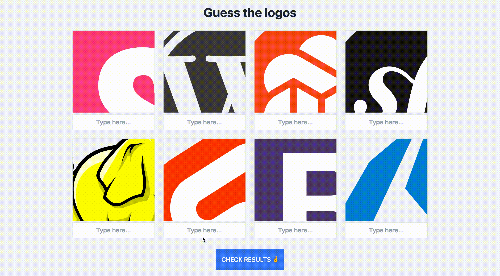

# TWEB Challenge

Ceci est un exercice pratique dans lequel vous allez créer un jeu de quiz avec JavaScript, HTML CSS et Node.js. Le joueur devra deviner le nom de la technologie web qui se cache derrière chaque logo. Pour corser la partie, les logos ne seront que partiellement visible.



### Démarrage

Commencez par exécuter la commande suivante pour installer les dépendances du projet :
```
npm install
```

Puis, démarrez l'application en utilisant la commande ci-dessous :
```
npm run start
```

L'application est maintenant en cours d'exécution sur http://localhost:3000.

Vous pouvez également démarrer l'application avec `npm run watch`. Cette commande permet de relancer le serveur dès qu'un fichier est modifié.

### Cahier des charges

Pour réussir ce challenge, on vous demande d'apporter les modifications nécessaires au projet de base qui vous est fournis, afin de remplir le cahier des charges suivant :

1. La page d'accueil est construite du côté serveur et affiche 8 logos choisis aléatoirement (1pt)
2. Le joueur peut entrer une réponse en dessous de chaque logo à l'aide d'un champ texte. Lorsque le joueur clique sur le bouton "Check results", ses réponses sont envoyées au serveur par une requête POST à l'endpoint `/validate`. (2pt)
3. À l'endpoint `/validate`, le serveur compare les valeurs reçues avec les noms des logos puis retourne une réponse au format JSON contenant le score du joueur (nombre de réponses corrects) ainsi que les solutions du quiz (l'identifiant des logos avec leurs noms). (2pt)
4. Lors de la vérification des valeurs reçues, la casse et les caractères spéciaux sont ignorés. Par exemple, les valeurs `nextjs` et `Next.js` sont considérées comme étant équivalentes. Écrivez un test unitaire pour valider ce comportement. (2pt)
5. Une fois les résultats récupérés côté client, un script modifie le DOM pour
   - afficher le score du joueur (1pt)
   - afficher la solution en dessous de chaque logo (2pt)

